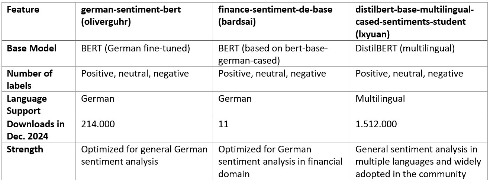
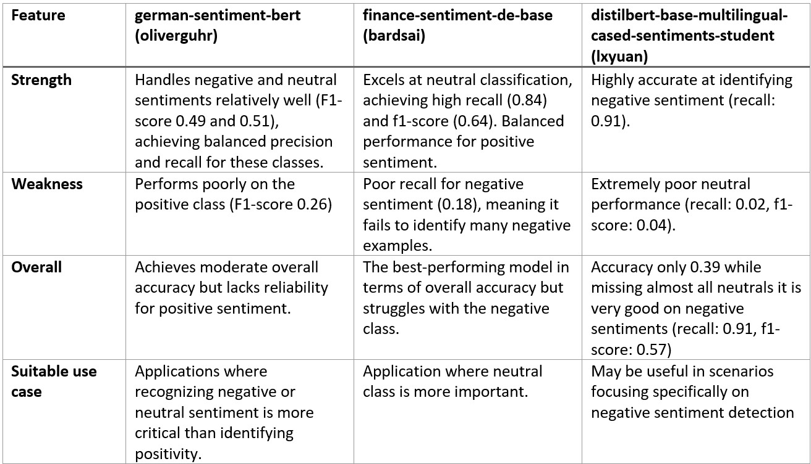
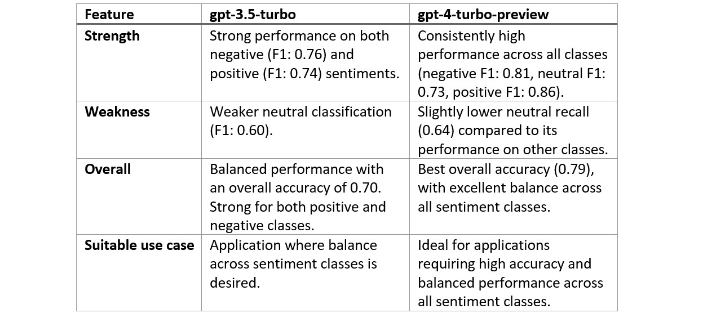
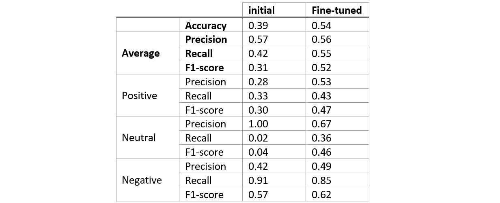
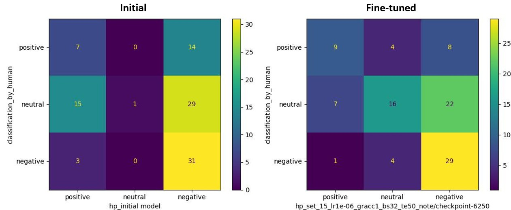

# AI Fine-Tuning for Sentiment Analysis

## 📜 Project Overview

Financial forums offer valuable insights into investor sentiment, but extracting actionable information is challenging due to the unstructured nature of the data. This project addresses this gap by providing  a scalable, cost-efficient solution for sentiment analysis of forum posts, enabling investors to make data-driven decisions as part of their investment strategies.  
The project focuses on fine-tuning and developing a sentiment analysis model specifically tailored for financial forum posts. It demonstrates how to effectively combine open-source models with commercial AI solutions to achieve a cost-efficient and high-performing system. By leveraging advanced fine-tuning techniques, the project significantly enhances sentiment analysis capabilities while reducing dependency on costly APIs for large-scale applications.

**Note**: The code for this project was written manually without the assistance of AI tools, to foster a deeper learning and skill development.

## 💡 Key Features

- **Data Preprocessing**:
  - Transformation of data from pickle files to CSV format for better accessibility and usability.

- **Model Comparison**:
  - Evaluation of sentiment analysis performance using three open-source models from Huggingface and two GPT models from OpenAI.

- **Model Fine-Tuning and Cost Optimization**:
  - Efficient dataset creation by classification of 5000 forum posts using the best-performing GPT model to generate a high-quality labeled dataset.
  - Fine-tuning a selected open-source model from Huggingface using the labeled data to improve performance.
  - Optimization of performance through hyperparameter tuning and comprehensive evaluations using metrics such as accuracy, precision, recall, F1 score, and confusion matrices.
  - Leveraging TensorBoard visualizations to monitor and analyze learning processes across different sets of hyperparameters.

- **Result**:
  - Delivered a fine-tuned open-source model with significantly improved sentiment analysis capabilities (positive, neutral, negative).
  - Provided a robust, scalable, cost-free sentiment analysis solution tailored for financial forum posts.

   

   
    Confusion Matrix of Base Model
   

   

   
    Confusion Matrix of Fine-Tuned Model
   

## 🛠️ Getting Started in Google Colab 

- **Step 1**: 
  - Clone the repository and upload it into your gdrive.

- **Step 2**:
  - For making additional calls to GPT by OpenAI via the API, create at the same hierarchy level as the folder of the uploaded repository a file with the name “chatgpt_api_credentials.yaml” containing your personal open AI key in the form “openAI_key : […]”.
  
- **Step 3**:
  - Follow the notebook sequence (1_, 2_, 3_, …) using the standard CPU, except for the notebook nr. 5 containing the fine-tuning which shall be run using the T4 GPU (GPU-RAM: 15.0 GB)

- **Step 4**:
  - For loading and saving the data during your project, connect your gdrive by providing the necessary credentials when being asked for it.

## 📊 Results and Discussion

**Data Preparation**

The project began with converting two pickle files into a single CSV file containing approximately 86'000 forum posts. This CSV format was chosen for its accessibility and ease of use in data analysis workflows. Each post included essential metadata such as the post’s timestamp, associated company, and a unique post ID.

**Model Selection and Initial Evaluation**

Selection of open-source LLMs included the following criteria:  
- support for sentiment classification with three classes(positive, neutral, negative)  
- support of German language  
- suitability for the financial domain  
- level of community adoption 

And led to the selection of the following three models each with their key strenght as illustrated in the table below.

Performance Evaluation of open-source LLMs:
Each model was evaluated on 100 human-labeled forum posts and findings summarized in the table below, highlight each model's strengths and weaknesses. Given the project’s priority to accurately detect negative sentiment (critical for identifying risks and market concerns), the distilbert-base-multilingual-cased-sentiments-student model was chosen for fine-tuning.

Performance Evaluation of GPT models by OpenAI:
In addition to the open-soure models, two selected GPT models from OpenAI were evaluated for performing the same task. The results are summarized in the table below. Thereby, the metrics and confusion matrices showed that gpt-4-turbo-preview yielded excellent performance, achieving an accuracy of 0.79 and balanced F1-scores across all sentiment classes. To leverage its strength, gpt-4-turbo-preview was chosen to assign pseudo-labels for additional training data, enabling fine-tuning of the lxyuan model. This approach aimed to develop a freely available model with enhanced performance, driven by the high-quality pseudo-labels provided by gpt-4-turbo-preview.

**Generating Additional Training data via Pseudo-Labeling**

In this step, 5'000 additional forum posts were classified using the gpt-4-turbo-preview model from OpenAI via their API to generate pseudo-labels for fine-tuning the leaner open-source model. To ensure a robust classification process, the forum posts were processed in chunks of 500, with periodic saving of results to prevent data loss in the event of API connection issues. To further ensure the quality and streamline subsequent processing a DataCleanerAndRefiner class was created and employed. The class filtered out invalid responses from the gpt-4-turbo-preview model and mapped valid sentiment labels (positive, neutral, negative) into numerical categories, as was needed for the subsequent fine-tuning process.

**Fine-Tuning Process**

The pseudo-labeled dataset of 5,000 forum posts was split into:

- 4'000 posts for training.
- 1'000 posts for validation.
- The original 100 human-labeled posts served as the final test set.

To monitor the training process, key metrics were tracked and visualized using TensorBoard. These metrics included: accuracy, macro-averaged precision, recall, and f1-score, along with per-class precision, recall, and f1-score, providing a detailed assessment of model performance across all classes.
Hyperparameter tuning was conducted by systematically varying the learning rate, gradient accumulation, and batch size, with each configuration running for 10 epochs to identify the optimal configuration. Using the best-performing hyperparameter set (batch size: 32, learning rate: 1e-6, no gradient accumulation) was then used for an extended fine-tuning run of 50 epochs, resulting in a precise and well-optimized fine-tuned model (set_15_lr1e-06_gracc1_bs32_te50_note/checkpoint-6250).

**Final Results**

Final evaluation of the fine-tuned model on human-labeled test data demonstrated significantly improved performance across all classes and metrics as can be seen in the table below. Accuracy increased from 0.39 to 0.54, with notable gains in f1-scores, particularly for neutral sentiment, which improved from 0.04 to 0.46 – effectively addressing a key weakness in the initial model. These improvements were evident not only in the metrics but also in the confusion matrices below, which showed reduced misclassification and better class balance. Overall, these results demonstrate that the fine-tuning process significantly enhanced the open-source model to predict correct sentiment across all classes. 

## Future Work
- More details will follow. Stay tuned!