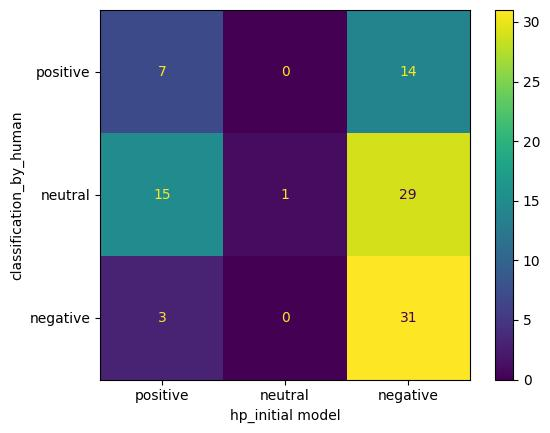
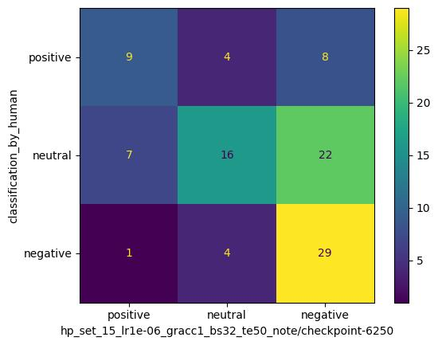

# AI Fine-Tuning for Sentiment Analysis

## Project Overview

From a business perspective, financial forums offer valuable insights into investor sentiment, but extracting actionable information is challenging due to the unstructured nature of the data. This project addresses this gap by providing  a scalable, cost-efficient solution for sentiment analysis of forum posts, enabling investors to make data-driven decisions as part of their investment strategies.

From a technical perspective, the project focuses on fine-tuning and developing a sentiment analysis model specifically tailored for financial forum posts. It demonstrates how to effectively combine open-source models with commercial AI solutions to achieve a cost-efficient and high-performing system. By leveraging advanced fine-tuning techniques, the project significantly enhances sentiment analysis capabilities while reducing dependency on costly APIs for large-scale applications.

## Key Features

- **Data Preprocessing**:
  - Transformation of data from pickle files to CSV format for better accessibility and usability.

- **Model Comparison**:
  - Evaluation of sentiment analysis performance using three open-source models from Huggingface and two GPT models from OpenAI.

- **Model Fine-Tuning and Cost Optimization**:
  - Efficient dataset creation by classification of 5000 forum posts using the best-performing GPT model to generate a high-quality labeled dataset.
  - Fine-tuning a selected open-source model from Huggingface using the labeled data to improve performance.
  - Optimization of performance through hyperparameter tuning and comprehensive evaluations using metrics such as accuracy, precision, recall, F1 score, and confusion matrices.
  - Leveraging TensorBoard visualizations to monitor and analyze learning processes across different sets of hyperparameters.

- **Result**:
  - Delivered a fine-tuned open-source model with significantly improved sentiment analysis capabilities (positive, neutral, negative).
  - Provided a robust, scalable, cost-free sentiment analysis solution tailored for financial forum posts.

   

   
    Confusion Matrix of Base Model
   

   

   
    Confusion Matrix of Fine-Tuned Model
   

## Future Work
- More details on the README are on the way, including a full walkthrough of all notebooks and an in-depth discussion of the results. Stay tuned! (Unless the coffee runs out… then progress may slow temporarily!)